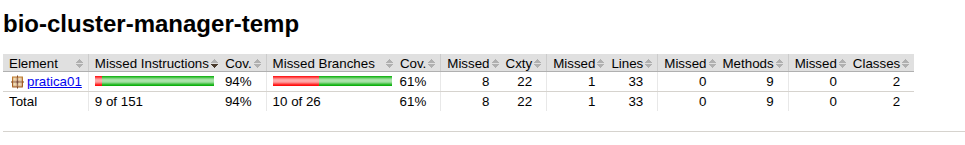
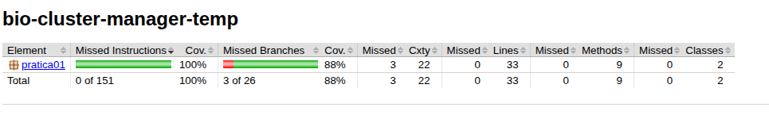
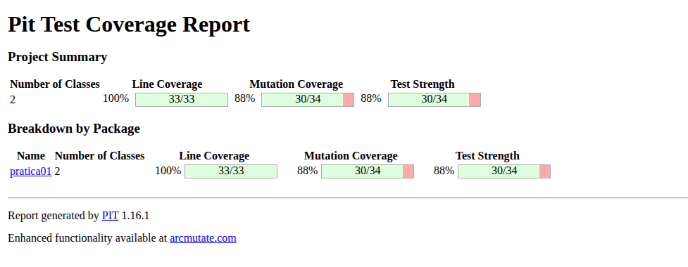

## 1. Introdução

O objetivo dessa prática foi testar o método processarClusters da classe BioClusterManager usando três técnicas: teste por especificação, teste estrutural (MC/DC) e teste de mutação.

Usar o mesmo método nas três foi útil pra comparar o que cada uma encontra. No meio da análise também apareceu um bug real no código — uma condição que compara o1 duas vezes em vez de comparar o1 com o2.

---

## 2. Método testado (resumo)

```java
public List<String> processarClusters(List<Observation> obs, double raio, double threshold,
        boolean modoInter, int limiteSeguranca)
```

1. Retorna lista vazia quando `obs.size() < 2`.
2. Para cada par `(o1, o2)`, calcula distância.
3. Cria conexão quando a condição composta é verdadeira.
4. Interrompe quando atinge `limiteSeguranca`.

Condição principal:

```text
(dist < raio && (mesmaEspecie || modoInter))
&& (o1.saude > threshold || o1.saude > threshold)
&& !(o1.invasora && o2.invasora)
```

---

## 3. Teste baseado em especificação

### 3.1 Partições de equivalência

- Quantidade de observações: `< 2` e `>= 2`
- Distância: `< raio` e `>= raio`
- Espécie/interação: mesma espécie, espécies diferentes com `modoInter = true`, espécies diferentes com `modoInter = false`
- Saúde: `> threshold` e `<= threshold`
- Invasoras: ambas invasoras / não ambas invasoras
- Limite de segurança: sem corte / com corte antecipado

### 3.2 Casos de teste

| ID   | Objetivo                                       | Resultado esperado |
| ---- | ---------------------------------------------- | ------------------ |
| CE01 | Lista com 1 observação                         | Retorna vazio      |
| CE02 | Cenário válido básico                          | Cria 1 conexão     |
| CE03 | `dist == raio` (borda)                         | Não cria conexão   |
| CE04 | Espécies diferentes sem modo inter             | Não cria conexão   |
| CE05 | Espécies diferentes com modo inter             | Cria conexão       |
| CE06 | Duas invasoras                                 | Não cria conexão   |
| CE07 | `saude == threshold`                           | Não cria conexão   |
| CE08 | `limiteSeguranca = 1` com vários pares válidos | Para na 1ª conexão |

Observação: nos testes, percebe-se que só `o1.saude` afeta a condição, por causa da repetição no código.

---

## 4. Teste estrutural (MC/DC)

Pra cada condição, escolhi dois casos onde só ela muda e o resultado muda junto:

### 4.1 Predicados da decisão

- `A`: `dist < raio`
- `B`: `o1.getEspecieId() == o2.getEspecieId()`
- `C`: `modoInter`
- `D`: `o1.getSaude() > threshold`
- `E`: `o1.getSaude() > threshold` (duplicado)
- `F`: `o1.isInvasora() && o2.isInvasora()`

### 4.2 Tabela reduzida para derivação dos testes

| Caso | A   | B   | C   | D   | E   | F   | R   |
| ---- | --- | --- | --- | --- | --- | --- | --- |
| M1   | T   | T   | F   | T   | T   | F   | T   |
| M2   | F   | T   | F   | T   | T   | F   | F   |
| M3   | T   | F   | F   | T   | T   | F   | F   |
| M4   | T   | F   | T   | T   | T   | F   | T   |
| M5   | T   | T   | F   | F   | F   | F   | F   |
| M6   | T   | T   | F   | T   | T   | T   | F   |

Pares usados:

- `A`: M1 × M2
- `B`: M1 × M3
- `C`: M3 × M4
- `D/E`: M1 × M5
- `F`: M1 × M6

### 4.3 Cobertura (Jacoco)

Resumo da cobertura observado (comparando suíte reduzida x suíte completa):

| Momento                                  | Line coverage | Branch coverage |
| ---------------------------------------- | ------------- | --------------- |
| Antes dos testes MC/DC (baseline)        | 94%           | 61%             |
| Depois dos testes MC/DC (suíte completa) | 100%          | 88%             |

- Cobertura (antes):


- Cobertura (depois):


### 4.4 Defeitos, erros e falhas encontrados

1. Repetição da condição de saúde:
   - Atual: `(o1.getSaude() > threshold || o1.getSaude() > threshold)`
   - Provável intenção: segunda parte usar `o2.getSaude()`.
2. Essa duplicação reduz a qualidade da decisão e impacta o próprio MC/DC.

---

## 5. Teste baseado em mutação (PIT)

Passos usados:

1. Rodar PIT com conjunto inicial.
2. Analisar mutantes sobreviventes.
3. Adicionar casos de borda.
4. Repetir.

### 5.1 Evolução do score

| Rodada                       | Score de mutação | Observação                                                 |
| ---------------------------- | ---------------- | ---------------------------------------------------------- |
| Execução no ambiente montado | 88%              | 34 mutações geradas, 30 mortas, sem mutações sem cobertura |



### 5.2 Resumo textual dos mutators

- ConditionalsBoundaryMutator: 7/7 mortos (100%)
- NegateConditionalsMutator: 13/13 mortos (100%)
- PrimitiveReturnsMutator: 4/5 mortos (80%)
- MathMutator: 3/6 mortos (50%)
- EmptyObjectReturnValsMutator: 1/1 morto (100%)
- BooleanTrueReturnValsMutator: 1/1 morto (100%)
- BooleanFalseReturnValsMutator: 1/1 morto (100%)

Os mutantes de lógica condicional foram bem cobertos; os que sobraram ficaram na parte matemática.

---

## 6. Conjunto de testes implementados

```java
import static org.junit.jupiter.api.Assertions.*;
import java.util.*;
import org.junit.jupiter.api.Test;

public class BioClusterManagerTest {

    private Observation observation(int id, int esp, double x, double y, double saude, boolean inv) {
        return new Observation(id, esp, x, y, saude, inv);
    }

    @Test
    void listaComUmElemento() {
        BioClusterManager bcm = new BioClusterManager();
        List<Observation> obs = List.of(observation(1, 1, 0, 0, 0.9, false));
        assertTrue(bcm.processarClusters(obs, 10, 0.5, false, 10).isEmpty());
    }

    @Test
    void cenarioValido() {
        BioClusterManager bcm = new BioClusterManager();
        List<Observation> obs = List.of(
            observation(1, 1, 0, 0, 0.9, false),
            observation(2, 1, 1, 1, 0.2, false)
        );
        assertEquals(1, bcm.processarClusters(obs, 5, 0.5, false, 10).size());
    }

    @Test
    void distanciaIgualRaio() {
        BioClusterManager bcm = new BioClusterManager();
        List<Observation> obs = List.of(
            observation(1, 1, 0, 0, 0.9, false),
            observation(2, 1, 3, 4, 0.9, false)
        );
        assertTrue(bcm.processarClusters(obs, 5, 0.5, false, 10).isEmpty());
    }

    @Test
    void especiesDiferentesSemInter() {
        BioClusterManager bcm = new BioClusterManager();
        List<Observation> obs = List.of(
            observation(1, 1, 0, 0, 0.9, false),
            observation(2, 2, 1, 1, 0.9, false)
        );
        assertTrue(bcm.processarClusters(obs, 5, 0.5, false, 10).isEmpty());
    }

    @Test
    void especiesDiferentesComInter() {
        BioClusterManager bcm = new BioClusterManager();
        List<Observation> obs = List.of(
            observation(1, 1, 0, 0, 0.9, false),
            observation(2, 2, 1, 1, 0.9, false)
        );
        assertEquals(1, bcm.processarClusters(obs, 5, 0.5, true, 10).size());
    }

    @Test
    void duasInvasoras() {
        BioClusterManager bcm = new BioClusterManager();
        List<Observation> obs = List.of(
            observation(1, 1, 0, 0, 0.9, true),
            observation(2, 1, 1, 1, 0.9, true)
        );
        assertTrue(bcm.processarClusters(obs, 5, 0.5, false, 10).isEmpty());
    }

    @Test
    void saudeNoLimite() {
        BioClusterManager bcm = new BioClusterManager();
        List<Observation> obs = List.of(
            observation(1, 1, 0, 0, 0.5, false),
            observation(2, 1, 1, 1, 0.9, false)
        );
        assertTrue(bcm.processarClusters(obs, 5, 0.5, false, 10).isEmpty());
    }

    @Test
    void limiteSeguranca() {
        BioClusterManager bcm = new BioClusterManager();
        List<Observation> obs = List.of(
            observation(1, 1, 0, 0, 0.9, false),
            observation(2, 1, 1, 1, 0.9, false),
            observation(3, 1, 2, 2, 0.9, false)
        );
        assertEquals(1, bcm.processarClusters(obs, 10, 0.5, false, 1).size());
    }
}
```

---

## 7. Conclusão

As três técnicas se complementam. A especificação ajudou a organizar os cenários, o MC/DC melhorou a cobertura de decisões e a mutação mostrou onde os testes ainda estavam fracos.
O bug na condição de saúde só ficou evidente quando o MC/DC forçou a análise de cada parte da decisão separadamente — sem isso provavelmente passaria batido.
O score de mutação foi 88%, o que foi bom pro escopo da prática. Os mutantes que sobraram ficaram no MathMutator, que é mais difícil de cobrir.
